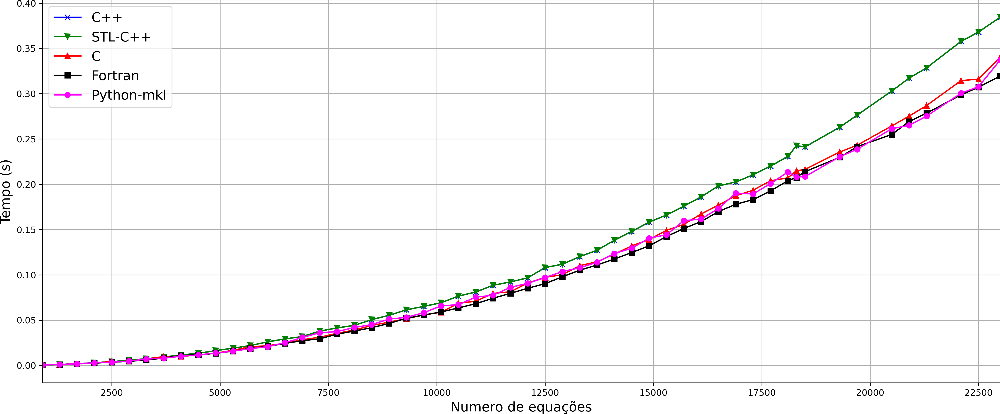

# ProdMatrizVetorCheio

Repositório com a implementação do produto matriz vetor para matriz cheia. 
Todas as versões são single core. O numpy utilizou a biblioteca mkl. 

As versões C, C++ e Fortran foram compiladas com o compilador intel. Os paramentros de compilação foram -O3
e fp-model = fast.

## Linguagens

* C
* C++
* Fortran
* Python-Mkl

## Resultados

A Fig 1. mostra o tempo (elapesed) da operação matriz-vetor de todas as versões. 
As versões C, Fortran e Python-mkl apresentaram desempenho bastantes similares, 
com uma ligeira vantagem para a versão Fortran. A versão C++ e C++-STL tiveram 
praticamente o mesmo desempenho sendo bem inferior as versões anterios.

*Fig 1. Tempos por número de equação para cada versão.* 
